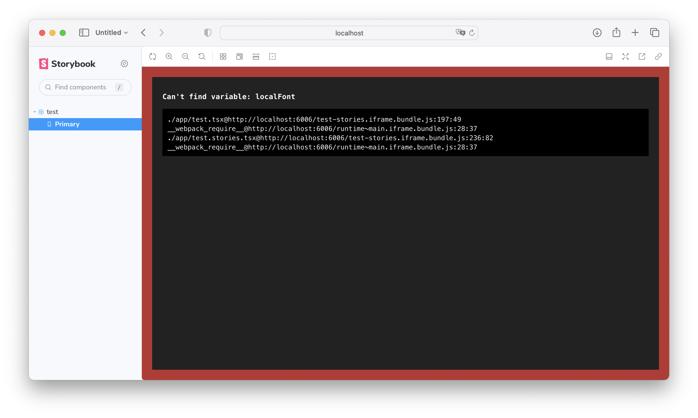

In this repository I set up nextjs, storybook, storybook test runner and storybook addon coverage according to their respective docs.

To reproduce:

```
npm i
npm run storybook
```

Will cause the following error in the browser:


```
npm run test-storybook
```

Will cause the following error log:

```
➜  next-storybook-coverage git:(main) ✗ npm run test-storybook

> next-storybook-coverage@0.1.0 test-storybook
> test-storybook --coverage

 FAIL   browser: chromium  app/test.stories.tsx
  test
    Primary
      ✕ smoke-test (25 ms)

  ● test › Primary › smoke-test

    page.evaluate: StorybookTestRunnerError:
    An error occurred in the following story. Access the link for full output:
    http://127.0.0.1:6006/?path=/story/test--primary&addonPanel=storybook/interactions/panel

    Message:
     The story was missing when trying to access it.


    --------------------------------------------------

    Browser logs:

    error: ReferenceError: localFont is not defined
    ReferenceError: localFont is not defined

      at ./app/test.tsx (http:/127.0.0.1:6006/test-stories.iframe.bundle.js:197:40)
      at __webpack_require__ (http:/127.0.0.1:6006/runtime~main.iframe.bundle.js:28:33)
      at fn (http:/127.0.0.1:6006/runtime~main.iframe.bundle.js:299:21)
      at ./app/test.stories.tsx (http:/127.0.0.1:6006/test-stories.iframe.bundle.js:236:63)
      at __webpack_require__ (http:/127.0.0.1:6006/runtime~main.iframe.bundle.js:28:33)
      at fn (http:/127.0.0.1:6006/runtime~main.iframe.bundle.js:299:21)
      at http:/127.0.0.1:6006/main.iframe.bundle.js:30:10
      at async StoryStore.importFn (http:/127.0.0.1:6006/main.iframe.bundle.js:150:27)
      at async StoryStore.loadStory (http:/127.0.0.1:6006/sb-preview/runtime.js:47:9856)
      at async http:/127.0.0.1:6006/sb-preview/runtime.js:81:9005
      at Object.<anonymous> (<anonymous>:287:13)
      at http:/127.0.0.1:6006/sb-preview/runtime.js:4:95626
          at Array.forEach (<anonymous>)
      at Channel.handleEvent (http:/127.0.0.1:6006/sb-preview/runtime.js:4:95610)
      at handler (http:/127.0.0.1:6006/sb-preview/runtime.js:4:94698)
      at Channel.emit (http:/127.0.0.1:6006/sb-preview/runtime.js:4:94753)
      at PreviewWeb.renderStoryLoadingException (http:/127.0.0.1:6006/sb-preview/runtime.js:103:686)
      at PreviewWeb.renderSelection (http:/127.0.0.1:6006/sb-preview/runtime.js:101:3233)
      at app/test.stories.tsx:168:58
      at step (app/test.stories.tsx:109:23)
      at Object.next (app/test.stories.tsx:50:20)
      at asyncGeneratorStep (app/test.stories.tsx:4:28)
      at _next (app/test.stories.tsx:22:17)
      at app/test.stories.tsx:27:13
      at app/test.stories.tsx:19:16
      at testFn (app/test.stories.tsx:220:49)
      at Object.<anonymous> (app/test.stories.tsx:233:33)
      at step (app/test.stories.tsx:109:23)
      at Object.next (app/test.stories.tsx:50:20)
      at asyncGeneratorStep (app/test.stories.tsx:4:28)
      at _next (app/test.stories.tsx:22:17)
      at app/test.stories.tsx:27:13
      at Object.<anonymous> (app/test.stories.tsx:19:16)

Coverage file (1208 bytes) written to .nyc_output/coverage.json
Test Suites: 1 failed, 1 total
Tests:       1 failed, 1 total
Snapshots:   0 total
Time:        4.217 s
Ran all test suites.
----------|---------|----------|---------|---------|-------------------
File      | % Stmts | % Branch | % Funcs | % Lines | Uncovered Line #s
----------|---------|----------|---------|---------|-------------------
All files |      50 |      100 |       0 |      50 |
 test.tsx |      50 |      100 |       0 |      50 | 8
----------|---------|----------|---------|---------|-------------------
➜  next-storybook-coverage git:(main) ✗
```

Removing `"@storybook/addon-coverage"` from the addons array in `.storybook/main.ts` will fix the bug but obviously no coverage can be reported.
